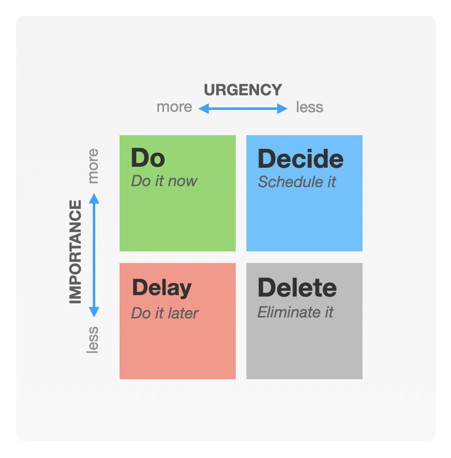

# Closing Thoughts

## Deadlines

#### Work harder

Aka, put in more hours.





#### Add resources

Aka, pulling additional engineers into a project.  which is [usually a bad idea](https://en.wikipedia.org/wiki/The\_Mythical\_Man-Month).

#### Extend/Rethink deadlines

See: [https://youtu.be/goihWvyqRow?t=920](https://youtu.be/goihWvyqRow?t=920) (Lead Time and Cycle Time)

#### Reduce scope

#### Revisit planning

Review what we talked about here.  Especially retrospecting on [velocity](velocity.md).

### Real vs artificial deadlines

###

## Topics I ignored

Burn-down chart

A burn-down chart is essentially a way to visually see the progress you make on a milestone with the goal of eventually "burning down" enough of the work that there is nothing left to do and the task is complete.

I've never seen a burn-down chart actually help anyone.  Sure, they're pretty to look at and give a sense of accomplishment to the engineers and control to the product managers, but their benefit is superficial and usually outweighed by their inaccuracy as you continue to add more wood (tasks) to the fire.  Even worse, when the burn-down trends towards a later completion date than expected, it can be abused to justify artificial [deadlines](closing-thoughts.md#undefined).

Lastly, a burn-down chart encourages teams to work on one feature set (story) at a time, which is not very agile.

User Story

Also see: [https://www.overmindlabs.com/cube/demo](https://www.overmindlabs.com/cube/demo)

Sprint Retrospect

Scrum Master, Iteration Manager, Task Manager

Agile Certification

"The Agile certifications that exist are a complete joke and an utter absurdity. Do not take the certifications seriously." - [Robert Martin](https://www.amazon.com/Clean-Agile-Basics-Robert-Martin/dp/0135781868), the father of Agile.

### Choose your own adventure

\*\*\*Should caveat that everything we're going to demonstrate is just an example of how to do things.  The biggest pitfall regarding agile development is assuming there is a single "correct" way.  If you forget about the higher level vision of what agile provides, then it becomes work for the sake of work rather than an actual benefit to the engineering teams.  You should talk with the engineers frequently to ensure whatever method you employ works for them.  And, because I believe agile development planning is something that should be done at the team level (and no higher), each team should feel free to adopt whatever style best fits their needs.  It's best to keep consistency across an org, as engineers tend to move teams and will need to collaborate across teams, but it's also good to note that different teams tackle engineering problems differently: because of its members and because of its problem space.
